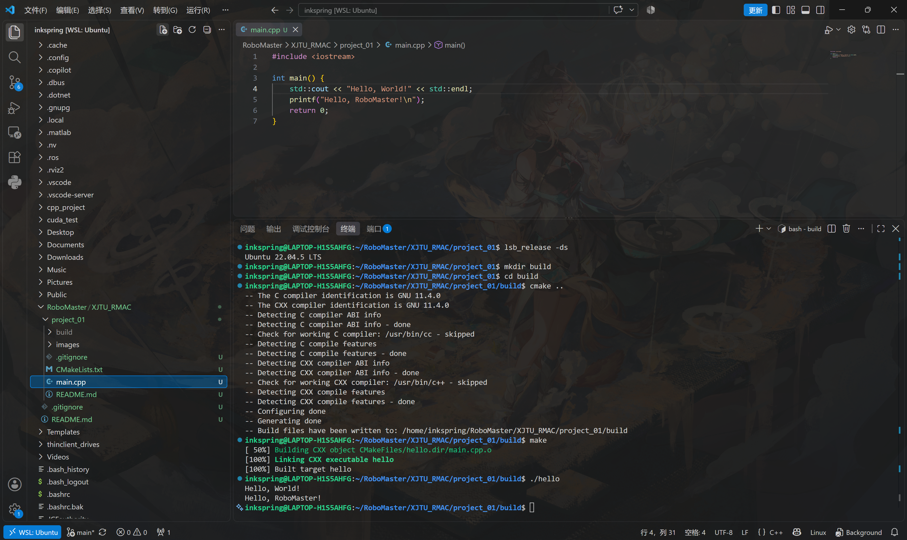

# Hello Cmake

## 环境
- Ubuntu 22.04.5 LTS
- g++ 11.4.0
- CMake 3.22.1

## 构建与运行
```bash
mkdir build
cd build
cmake ..
make
./hello
```
## 预期输出
```bash
Hello, World!
Hello, RoboMaster!
```

## 运行成功截图
